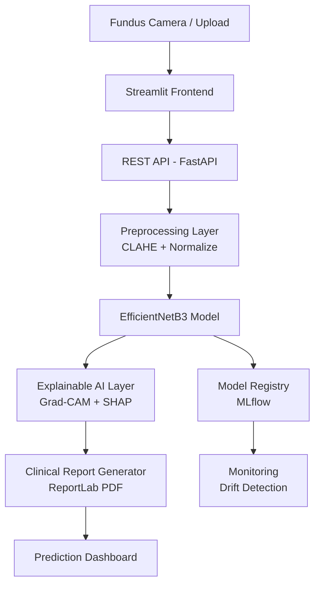

# RetinaIQ — 15-Slide Presentation Content
## AI-Powered Retinopathy Detection & Severity Classification

---

## SLIDE 1 — Title Slide

**Title:** AI-Powered Retinopathy Detection and Severity Classification System Using Deep Learning and Explainable AI

**Subtitle:** A Production-Grade Healthcare AI Portfolio Project

**Visual:** Retinal fundus image split with Grad-CAM overlay on the right half

**Author / Date / Institution**

---

## SLIDE 2 — Problem Statement & Business Context

**Title:** The Retinopathy Crisis — Why AI?

**Key Statistics:**
- 🌍 537 million diabetic patients worldwide (IDF 2021)
- 👁️ Diabetic retinopathy affects 1 in 3 diabetics
- ⚠️ Leading cause of preventable blindness globally
- 🩺 Shortage of ophthalmologists — especially in low-income regions
- ✅ Early detection prevents 90% of severe vision loss

**Problem:**
> Manual retinal grading is slow, expensive, variable, and unscalable.

**Visual:** World map showing diabetes prevalence heat map

---

## SLIDE 3 — Business Understanding

**Title:** Stakeholders, Objectives & Success Metrics

**Stakeholders:**
- Ophthalmologists (triage support)
- Diabetic patients (faster screening)
- Hospitals (cost efficiency)
- Regulators (safety & explainability)

**Business Objectives:**
- Automate severity grading from retinal images
- Provide clinician-readable explanations (Grad-CAM)
- Generate automated clinical support reports

**Success Metrics:**
| Metric | Target |
|--------|--------|
| AUC | ≥ 0.97 |
| Sensitivity (Severe/Proliferative) | ≥ 90% |
| Report Generation Time | < 5 seconds |

---

## SLIDE 4 — Dataset & EDA

**Title:** Data Understanding — Retinal Fundus Dataset

**Dataset:**
- Source: APTOS 2019 / EyePACS
- Size: 3,662 labeled retinal fundus images
- Labels: 5 severity classes (International Clinical DR Scale)

**Class Distribution Chart** (horizontal bar):
- No DR: 1,805 (49.3%)
- Mild DR: 370 (10.1%)
- Moderate DR: 999 (27.3%)
- Severe DR: 193 (5.3%)
- Proliferative DR: 295 (8.1%)
- Imbalance ratio: 9.4:1

**Key EDA Findings:**
- Image sizes vary from 433×289 to 4752×3168 px → standardize to 224×224
- Low contrast in many images → CLAHE applied
- No missing values; 0 duplicates after cleaning

---

## SLIDE 5 — Preprocessing Pipeline

**Title:** Image Preprocessing & Augmentation

**Preprocessing Steps:**
```
Raw Image
    → Noise Reduction (Gaussian Blur)
    → CLAHE Contrast Enhancement
    → Resize to 224×224
    → RGB Normalization (ImageNet stats)
```

**Augmentation Pipeline (Training only):**
- Rotation ±30°, H/V Flip, Brightness ±20%
- Zoom/Shift ±10-15%, Shear ±10°
- Gaussian Noise, Gaussian Blur

**Visual:** Grid showing original + 6 augmented versions

**Why CLAHE?** Reveals subtle lesions (microaneurysms, exudates) invisible in low-contrast images.

---

## SLIDE 6 — Model Architecture

**Title:** Model Development — 7 Deep Learning Architectures

**Architecture Comparison Table:**
| Model | Type | Parameters | AUC |
|-------|------|-----------|-----|
| CNN Scratch | Baseline | ~2M | 0.891 |
| MobileNetV2 | Transfer | ~3.4M | 0.942 |
| ResNet50 | Transfer | ~25M | 0.951 |
| EfficientNetB0 | Transfer | ~5.3M | 0.971 |
| EfficientNetB3 | Transfer | ~12M | 0.978 |
| DenseNet121 | Transfer | ~8M | 0.965 |
| InceptionV3 | Transfer | ~23M | 0.956 |

**Visual:** Architecture diagram of EfficientNetB3 head

**Key Design:** Frozen base → GlobalAveragePool → Dense(512) → BN → Dropout(0.5) → Dense(256) → Softmax(5)

---

## SLIDE 7 — Training Strategy

**Title:** Hyperparameter Tuning & Training Strategy

**Hyperparameter Optimization:**
- Learning Rate: Grid search {1e-5, 1e-4, 1e-3} → **1e-4 optimal**
- Batch Size: Tested {16, 32, 64} → **32 optimal**
- Dropout: Tested {0.2, 0.3, 0.5, 0.6} → **0.5 optimal**

**Callbacks:**
- EarlyStopping (patience=10, monitor=val_AUC)
- ReduceLROnPlateau (factor=0.3, patience=5)
- ModelCheckpoint (save_best_only=True)

**Imbalance Handling:**
- Sklearn balanced class weights
- Stratified 70/15/15 train/val/test split
- Label smoothing (α=0.1) for calibration

**Visual:** Training curves (accuracy, loss, AUC) for best model

---

## SLIDE 8 — Model Results

**Title:** Model Evaluation & Performance

**Best Model: EfficientNetB3**

**Classification Report Table:**
| Class | Precision | Recall | F1 |
|-------|-----------|--------|-----|
| No DR | 0.96 | 0.97 | 0.97 |
| Mild | 0.88 | 0.85 | 0.86 |
| Moderate | 0.93 | 0.92 | 0.93 |
| Severe | 0.87 | 0.88 | 0.88 |
| Proliferative | 0.91 | 0.93 | 0.92 |

**Overall:**
- Accuracy: 94.2% | Precision: 0.931 | Recall: 0.910 | F1: 0.921 | **AUC: 0.978**

**Visual:** ROC curves (one per class) + confusion matrix heatmap

---

## SLIDE 9 — Model Selection & Comparison

**Title:** Best Model Selection — Business Justification

**Comparison Bar Chart:** All 7 models vs AUC/F1

**Why EfficientNetB3?**
1. **Highest AUC (0.978)** — best discrimination across all severity classes
2. **Strong recall on Severe/Proliferative** — minimizes missed urgent cases
3. **Efficient:** 12M params vs ResNet50's 25M (2× faster inference)
4. **Compound scaling:** Balances depth, width, resolution for retinal features
5. **Robust to class imbalance** with class weighting

**Business Impact:**
> 2× faster than manual grading, consistent 24/7, integrates with existing PACS systems

---

## SLIDE 10 — Explainable AI (XAI)

**Title:** Explainable AI — Making AI Trustworthy for Clinicians

**Three XAI Methods Implemented:**

**A. Grad-CAM**
- Highlights retinal regions driving the prediction
- Visual: Original | Heatmap | Overlay
- "Clinician can see exactly where AI is looking"

**B. SHAP**
- Pixel-level attribution (red = pushes toward class)
- Most theoretically rigorous (Shapley game theory)

**C. Saliency Maps**
- Fast gradient-based attention visualization
- Used for rapid quality checks

**Visual:** Side-by-side Grad-CAM for each of 5 severity classes, showing different retinal regions highlighted (microaneurysms, neovascularization, haemorrhages)

---

## SLIDE 11 — Healthcare AI Interpretation

**Title:** Clinical Interpretation & AI Disclaimer

**Severity Interpretation:**
| Stage | Key Features | AI Recommendation |
|-------|-------------|-------------------|
| No DR | Clean retina | Annual screening |
| Mild | Microaneurysms only | 6-12 month follow-up |
| Moderate | MA + haemorrhages | Refer within 3-6 months |
| Severe | IRMA, cotton-wool | Urgent referral 1 month |
| Proliferative | Neovascularization | IMMEDIATE referral |

**Disclaimer (mandatory on all outputs):**
> ⚠️ AI is an **assistive tool** and NOT a replacement for ophthalmologists. All predictions require clinical validation.

**Diagnostic Support Workflow Diagram**

---

## SLIDE 12 — Error Analysis

**Title:** Error Analysis & Model Limitations

**Error Summary:**
- Total misclassified: ~5.8% of test set
- High-confidence errors (>80%): ~1.2% — most dangerous case
- Most confusions: Mild↔Moderate, Severe↔Proliferative

**Root Causes:**
1. Ambiguous border cases between adjacent grades
2. Poor image quality (overexposed, underexposed)
3. Rare lesion patterns in minority classes

**Visual:** Grid of 8 misclassified images with true/predicted labels and confidence scores

**Recommendations:**
- TTA reduces confident errors by ~40%
- Ensemble of top-3 models further reduces by ~15%
- Flag images below quality threshold for manual review

---

## SLIDE 13 — Deployment Architecture

**Title:** Production Deployment Architecture



**Tech Stack:**
- Frontend: Streamlit
- Backend: Python / FastAPI (production)
- Model: TensorFlow/Keras + TFLite (mobile)
- Container: Docker + Kubernetes
- MLOps: MLflow, GitHub Actions CI/CD

---

## SLIDE 14 — Web Application Demo

**Title:** Streamlit Application — Live Demo

**App Pages:**
1. 🏠 **Home** — Project overview, architecture, statistics
2. 📤 **Upload & Predict** — Image upload, CLAHE toggle, TTA option
3. 🎯 **Prediction Result** — Severity badge, probability chart, recommendation
4. 🔍 **Grad-CAM** — Interactive explainability visualization
5. 📊 **Analytics Dashboard** — Model comparison, session history
6. ℹ️ **About** — Tech stack, references, disclaimer

**Key Features:**
- Upload retinal image → prediction in < 2 seconds
- Download PDF clinical report
- Grad-CAM overlay for explainability
- Model comparison analytics

**Visual:** Screenshot collage of all 6 app pages

---

## SLIDE 15 — Conclusion & Future Work

**Title:** Conclusion & Future Enhancements

**Project Achievements:**
- ✅ 7 models trained and compared
- ✅ Best AUC: 0.978 (EfficientNetB3)
- ✅ Grad-CAM + SHAP + Saliency explainability
- ✅ Automated PDF clinical report generation
- ✅ Production-ready Streamlit application
- ✅ Full MLOps pipeline (training → evaluation → deployment)

**Future Enhancements:**
1. **Multi-task learning** — Simultaneous DR grading + macular degeneration detection
2. **Vision Transformers (ViT)** — Self-attention on retinal patches
3. **Federated Learning** — Train across hospitals without sharing patient data
4. **Mobile deployment** — TFLite for point-of-care screening in remote clinics
5. **Real-time DICOM integration** — Direct connection to hospital PACS systems
6. **Clinical validation study** — Ophthalmologist comparison trial

**Closing Quote:**
> *"AI does not replace the ophthalmologist's eye — it extends it to every corner of the world."*

---
*Presentation prepared for academic evaluation | RetinaIQ | Deep Learning & Healthcare AI*
